# SUBSIDE Tapis Workflows — Design Log

Running log of every decision we make wiring up the Tapis Workflows pipeline. Each new decision gets a dated entry with the **decision**, the **why**, and any **open follow-ups**. Newest entries on top.

Authoritative references:
- Tapis Workflows: https://tapis.readthedocs.io/en/latest/technical/workflows.html
- Tapis Jobs: https://tapis.readthedocs.io/en/latest/technical/jobs.html
- Tapis Files (archives): https://tapis.readthedocs.io/en/latest/technical/files.html

Related local docs:
- `subside/TAPIS_WORKFLOW_TODO.md` — multi-session work plan; this file is the design memory inside the "Tapis Workflow Design" section.
- `subside/workflow_apps/{h2i_lab,werc}/` — the registered Tapis apps that the heavy tasks call.
- `subside/subside_analysis/{h2i_lab,werc}/` — the Python code the apps run.

---

## 2026-05-28 — Resolved (answers from user)

- **Q1 → Tenant: `portals.tapis.io`.** PortalsCI tenant. New workflow group `subside-ops` (assumed; rename via env var in registration script if needed).
- **Q2 → Archive system + path:** unchanged. Keep `cloud.data` with `HOST_EVAL($HOME)/tapis-jobs-archive/${JobCreateDate}/${JobName}-${JobUUID}`. Each pipeline run writes one archive directory; downstream tasks reference it as their input source via the Tapis Files API.
- **Q3 → WERC granularity: four tasks per stage.** `build-stack`, `compute-reference`, `estimate-velocity`, `export-geotiffs`. Trade-off accepted: each stage boundary spills the combined displacement stack (~GB-scale) to NetCDF on the archive and the next stage opens it. Mitigations called out under "Data passing between tasks" below.
- **Q4 → CKAN: later.** v1 `publish` task is stdlib JSON munging only.

### Image + app strategy

To support per-stage decomposition without ballooning the image catalogue, **one Docker image per package, multiple Tapis apps per stage**:

| Image                              | Used by Tapis apps                                                                                                                                          |
| ---------------------------------- | ----------------------------------------------------------------------------------------------------------------------------------------------------------- |
| `subside-h2i-opera-analysis`       | `subside-h2i-discover`, `subside-h2i-analyze`                                                                                                               |
| `subside-werc-opera-analysis`      | `subside-werc-build-stack`, `subside-werc-compute-reference`, `subside-werc-estimate-velocity`, `subside-werc-export-geotiffs`                              |

Each Tapis app sets a `STAGE` env var (or first arg) that `run.sh` dispatches on; the container then invokes the right `subside_analysis.<pkg>.cli <subcommand>`. App-level differences are queue / `maxMinutes` / `appArgs` / `fileInputs`, not the image. This keeps the GHA build down to two images while giving the pipeline N retry/skip points.

### Data passing between tasks

Tapis Workflows passes artifacts between tasks through the archive system. Each `tapis_job` task's outputs land in its job's archive directory; the next task reads from there using a Tapis Files URI (`tapis://<system>/<path>`).

For the WERC sub-stages, the heavy artifact is the combined displacement stack (one NetCDF per stage boundary). To keep transfer cost bounded:

- `build-stack` writes ONE combined `displacement_stack.nc` derived from all DISP-S1 NetCDFs. Subsequent stages read only this single file, not the per-product NetCDFs.
- `compute-reference` writes `displacement_stack_referenced.nc` (the same stack with reference offset applied) + `reference_summary.json` + the anchor JSON.
- `estimate-velocity` writes `velocity.nc` (small — single 2D raster) + `velocity_summary.json`.
- `export-geotiffs` consumes both the referenced stack and the velocity raster; writes `opera_disp_s1_cumulative.tif` + `opera_disp_s1_velocity.tif` + `export_summary.json`.

Archive paths use a deterministic convention so the next task knows where to look:

```
<archive>/<run-id>/
  preflight-manifest.json
  OPERA_L3_DISP-S1/                 # h2i_lab download products
  displacement_stack.nc             # build-stack output
  displacement_stack_referenced.nc  # compute-reference output
  reference_anchor_FRAME{ID}.json
  reference_summary.json
  velocity.nc
  velocity_summary.json
  opera_disp_s1_cumulative.tif
  opera_disp_s1_velocity.tif
  export_summary.json
  subside-run-manifest.json         # publish output
```

Each task receives the archive base path as an env var (`SUBSIDE_RUN_DIR`) and writes/reads files by deterministic name. No need for the pipeline definition to thread paths between tasks explicitly.

---

## 2026-05-28 — Initial pipeline shape (proposed; pending answers)

### Decision: split the work into 3–4 Tapis Workflow tasks per pipeline

Two pipelines, sharing the discovery / publish tasks:

**Pipeline A: `subside-h2i-opera`** (download + preview only)

```
  discover ──▶ download-opera ──▶ publish
```

**Pipeline B: `subside-werc-opera`** (full stack / reference / velocity)

```
  discover ──▶ download-opera ──▶ build-stack ──▶ compute-reference ──▶ estimate-velocity ──▶ export-geotiffs ──▶ publish
```

(Revised 2026-05-28 after Q3 answer — see "Resolved" section above.)

### Task taxonomy

| Task                  | Type        | What it does                                                                                                                                                                                                  | Tapis app / impl                                  |
| --------------------- | ----------- | ------------------------------------------------------------------------------------------------------------------------------------------------------------------------------------------------------------- | ------------------------------------------------- |
| `discover`            | `tapis_job` | `python -m subside_analysis.h2i_lab.cli preflight`. Fast (~30 s). Outputs `preflight-manifest.json` with frame_ids, product_count, warnings. Fails pipeline if `product_count == 0`.                          | `subside-h2i-discover` (`STAGE=preflight`)        |
| `download-opera`         | `tapis_job` | `python -m subside_analysis.h2i_lab.cli run`. Heavy: parallel Earthdata download + crop, preview, zip. Outputs `run-manifest.json` + NetCDFs + previews + archive.                                            | `subside-h2i-analyze` (`STAGE=run`)               |
| `build-stack`         | `tapis_job` | `python -m subside_analysis.werc.cli build-stack`. Reads the per-product NetCDFs from `download-opera`'s archive; writes one combined `displacement_stack.nc` + `disp_products.json`.                            | `subside-werc-build-stack`                        |
| `compute-reference`   | `tapis_job` | `python -m subside_analysis.werc.cli compute-reference`. Reads stack; auto- or manual-picks reference pixels; writes `displacement_stack_referenced.nc` + `reference_anchor_FRAME{ID}.json` + `reference_summary.json`. | `subside-werc-compute-reference`                  |
| `estimate-velocity`   | `tapis_job` | `python -m subside_analysis.werc.cli estimate-velocity`. Reads referenced stack; linear fit; writes `velocity.nc` + `velocity_summary.json`.                                                                  | `subside-werc-estimate-velocity`                  |
| `export-geotiffs`     | `tapis_job` | `python -m subside_analysis.werc.cli export-geotiffs`. Reads referenced stack + velocity; writes `opera_disp_s1_cumulative.tif` + `opera_disp_s1_velocity.tif` + `export_summary.json`.                       | `subside-werc-export-geotiffs`                    |
| `publish`             | `function`  | Stdlib-only Python. Reads every `*manifest.json` / `*summary.json` from the run archive; emits a unified `subside-run-manifest.json` the UI can consume. CKAN publication deferred (Q4).                       | Inline Python in the pipeline definition.         |

### Why split it this way

- **`discover` is its own task** so the pipeline fails fast and cheaply if the AOI has no products. Without this, we'd burn a heavy queue slot just to discover "nothing to do."
- **`download-opera` and `analyze-werc` are separate tasks** so:
  - The H2I-only pipeline (Pipeline A) can stop after `download-opera` and ship preview/archive without paying for WERC.
  - Failed WERC analysis can be retried against the same `download-opera` output without re-downloading multi-GB NetCDFs (uses `skip_download=true`).
- **`publish` is a `function` task** because it's pure JSON munging — no need to spin up a container.
- **Heavy work stays as `tapis_job`** because of dependency weight (`disp-xr`, `rasterio`, `gdal`, etc.). Tapis function tasks run in the workflows runner environment, which we shouldn't bloat with conda envs.

### Why NOT decompose WERC further (stack / reference / velocity / export as separate tasks)

Considered: making each WERC analysis stage its own task. Rejected for v1:

- Data movement cost: passing a multi-GB displacement stack between tasks via the archive would dominate runtime.
- Limited benefit: per-stage retry isn't useful because failures in stack assembly almost always mean re-running everything anyway.
- Complexity: 4 tasks where 1 will do, with no offsetting upside.

Revisit if we find ourselves wanting per-stage UI status or selective re-run.

---

## 2026-05-28 — Reusable ETL primitives extracted

Independently of the Tapis Workflows wiring above, the Python code under `subside_analysis/` was refactored to surface the cross-cutting primitives both packages need. A new `subside_analysis/etl/` package holds dataset-agnostic helpers; `h2i_lab` and `werc` import from it. See [`subside_analysis/REUSABLE_PRIMITIVES.md`](../subside_analysis/REUSABLE_PRIMITIVES.md) for the function-by-function catalog and the deferred items.

What this means for the Tapis Workflows side:

- **No Dockerfile / app JSON changes.** The Tapis images already `COPY subside_analysis /opt/subside/subside_analysis`, so `etl/` ships with both images automatically.
- **No pipeline YAML / `register.py` changes.** Pipeline tasks invoke CLI subcommands, not Python internals; the move was import-only.
- **Behaviour-preserving.** Verified by a fresh preflight run against the Houston-Galveston sample AOI (3 frames, 2 products) producing identical results to the pre-refactor run.

What the second-analysis story now looks like (e.g. other InSAR DAACs, HLS, Sentinel-2):

- The new analysis stands up its own `subside_analysis/<new_pkg>/{config,runner,cli}.py` composition layer.
- It imports `subside_analysis.etl.{auth, aoi, manifest, stack, archive}` for the cross-cutting bits — Earthdata auth survives URS OAuth redirects, AOI loading + bbox conversions, manifest writing, NetCDF stack save/load, zip archive.
- It defines its own discovery / metadata / product-specific stack assembly (analogous to today's `h2i_lab.aoi`, `h2i_lab.metadata`, `werc.stack`).
- Its Tapis app(s) follow the same Dockerfile + `run.sh` + STAGE-dispatch pattern; its workflow pipeline follows the same YAML shape (discover → analyze → publish, or with stage decomposition à la WERC).

Deferred items (quality layers, reference selection, velocity, GeoTIFF writers, preview, OPERA frame index → `opera_disp/`) intentionally still live in `h2i_lab`/`werc` because they have only one consumer; promotion happens when a second analysis lands to validate the right API surface.

---

## Implementation status — 2026-05-28

| Piece                                                                              | Status     | Location                                                                                       |
| ---------------------------------------------------------------------------------- | ---------- | ---------------------------------------------------------------------------------------------- |
| Per-stage WERC CLI subcommands (`build-stack`, `compute-reference`, `estimate-velocity`, `export-geotiffs`) | done       | `subside_analysis/werc/cli.py`, `subside_analysis/werc/runner.py`                              |
| Stack save/load NetCDF spill (with `frame_id` stashed as a stack attr)             | done       | `runner._save_stack` / `runner._load_stack`                                                    |
| `run.sh` STAGE dispatch (both h2i_lab + werc)                                      | done       | `workflow_apps/{h2i_lab,werc}/run.sh`                                                          |
| Per-stage Tapis app JSONs (5 new: discover + 4 WERC stages)                        | done       | `workflow_apps/{h2i_lab,werc}/app-*.json`                                                      |
| Pipeline YAML (A: h2i-opera, B: werc-opera)                                        | done — schema unverified | `workflows/pipelines/{h2i-opera,werc-opera}.yaml`                                  |
| Registration script (tapipy)                                                       | done — schema unverified | `workflows/register.py`                                                            |
| `workflows/README.md` explaining the registration flow + invocation                | done       | `workflows/README.md`                                                                          |
| `publish` function task body (stdlib JSON munging)                                 | done — runtime fetch placeholder | inline in each pipeline YAML                                            |

### Architecture diagram

Color key:

| Color | Group |
| --- | --- |
| Blue | `subside_analysis/etl/` — reusable primitives (any analysis) |
| Green | `subside_analysis/h2i_lab/` — OPERA H2I package |
| Purple | `subside_analysis/werc/` — OPERA WERC package |
| Orange | `workflow_apps/` — Tapis apps + `run.sh` |
| Yellow | `workflows/pipelines/*.yaml` — Tapis pipeline tasks |
| Gray | Inputs you supply at run-pipeline time |
| Red | External systems (DAACs) |
| Pale green | Artifacts written to the archive |

```mermaid
flowchart TB
    classDef inp      fill:#e5e7eb,stroke:#374151,color:#111;
    classDef ext      fill:#fee2e2,stroke:#b91c1c,color:#111;
    classDef pipeline fill:#fef3c7,stroke:#b45309,color:#111;
    classDef app      fill:#fed7aa,stroke:#c2410c,color:#111;
    classDef etl      fill:#dbeafe,stroke:#1e40af,color:#111;
    classDef h2i      fill:#dcfce7,stroke:#166534,color:#111;
    classDef werc     fill:#e9d5ff,stroke:#6b21a8,color:#111;
    classDef out      fill:#d1fae5,stroke:#047857,color:#111;

    %% Inputs (shared by both pipelines)
    AOI([AOI GeoJSON]):::inp
    CREDS([Earthdata creds<br/>env or .netrc]):::inp

    %% External systems
    OPIDX[(OPERA Frame Index)]:::ext
    ASF[(ASF Cumulus DAAC)]:::ext

    %% Two pipeline YAMLs, side by side
    subgraph PIPES["workflows/pipelines/"]
        direction LR
        subgraph PA["h2i-opera.yaml"]
            direction TB
            A1[discover]:::pipeline
            A2[download-opera]:::pipeline
            A3[publish<br/>function task]:::pipeline
            A1 --> A2 --> A3
        end
        subgraph PB["werc-opera.yaml"]
            direction TB
            B1[discover]:::pipeline
            B2[download-opera]:::pipeline
            B3[build-stack]:::pipeline
            B4[compute-reference]:::pipeline
            B5[estimate-velocity]:::pipeline
            B6[export-geotiffs]:::pipeline
            B7[publish<br/>function task]:::pipeline
            B1 --> B2 --> B3 --> B4 --> B5 --> B6 --> B7
        end
    end

    %% Tapis apps shared across both pipelines
    subgraph APPS["workflow_apps/"]
        direction LR
        subgraph APPS_H["h2i_lab/"]
            direction TB
            APP_DISC[subside-h2i-discover<br/>STAGE=preflight]:::app
            APP_ANL[subside-h2i-opera-analysis<br/>STAGE=run]:::app
            RH[run.sh<br/>STAGE dispatch]:::app
            APP_DISC --> RH
            APP_ANL --> RH
        end
        subgraph APPS_W["werc/"]
            direction TB
            APP_BS[subside-werc-build-stack]:::app
            APP_CR[subside-werc-compute-reference]:::app
            APP_EV[subside-werc-estimate-velocity]:::app
            APP_EG[subside-werc-export-geotiffs]:::app
            RW[run.sh<br/>STAGE dispatch]:::app
            APP_BS --> RW
            APP_CR --> RW
            APP_EV --> RW
            APP_EG --> RW
        end
    end

    %% Python packages (the image's payload)
    subgraph PKGS["subside_analysis/"]
        direction LR
        subgraph H2I["h2i_lab/"]
            direction TB
            H_CFG[config.py]:::h2i
            H_CLI[cli.py]:::h2i
            H_RNR[runner.py]:::h2i
            H_AOI[aoi.py<br/>OPERA frame index +<br/>ASF product search]:::h2i
            H_DL[download.py]:::h2i
            H_META[metadata.py<br/>DISP MintPy metadata]:::h2i
            H_PRV[preview.py<br/>PNG + Folium]:::h2i
            H_CLI --> H_RNR
            H_RNR --> H_AOI
            H_RNR --> H_DL
            H_RNR --> H_META
            H_RNR --> H_PRV
        end
        subgraph ETL["etl/  (reusable primitives)"]
            direction TB
            E_AUTH[auth.py<br/>EarthdataSession +<br/>creds resolution]:::etl
            E_AOI[aoi.py<br/>bbox + AOI load]:::etl
            E_MAN[manifest.py<br/>write_json]:::etl
            E_STK[stack.py<br/>save_stack / load_stack]:::etl
            E_ARC[archive.py<br/>zip helper]:::etl
        end
        subgraph WERC["werc/"]
            direction TB
            W_CFG[config.py]:::werc
            W_CLI[cli.py]:::werc
            W_RNR[runner.py<br/>per-stage entrypoints]:::werc
            W_STK[stack.py<br/>disp_xr wrappers]:::werc
            W_REF[reference.py<br/>quality + anchor]:::werc
            W_VEL[velocity.py<br/>linear fit]:::werc
            W_EXP[export.py<br/>GeoTIFF writers]:::werc
            W_CLI --> W_RNR
            W_RNR --> W_STK
            W_RNR --> W_REF
            W_RNR --> W_VEL
            W_RNR --> W_EXP
        end
    end

    %% Per-pipeline archives
    subgraph OUTS["Run archives"]
        direction LR
        subgraph OUT_A["Pipeline A archive"]
            direction TB
            PFM_A([preflight-manifest.json]):::out
            NCS_A([OPERA NetCDFs]):::out
            OVR([overlay.png]):::out
            HTML([Folium preview HTML]):::out
            ZIP([archive.zip]):::out
            RM_A([h2i run-manifest.json]):::out
            UM_A([subside-run-manifest.json]):::out
        end
        subgraph OUT_B["Pipeline B archive"]
            direction TB
            PFM_B([preflight-manifest.json]):::out
            NCS_B([OPERA NetCDFs]):::out
            RM_B([h2i run-manifest.json]):::out
            STK([displacement_stack.nc]):::out
            DSP([disp_products.json]):::out
            STKR([displacement_stack_referenced.nc]):::out
            ANC([anchor JSON per frame]):::out
            REFS([reference_summary.json]):::out
            VEL([velocity.nc]):::out
            VELS([velocity_summary.json]):::out
            CTIF([cumulative.tif]):::out
            VTIF([velocity.tif]):::out
            EXPS([export_summary.json]):::out
            UM_B([subside-run-manifest.json]):::out
        end
    end

    %% Inputs to pipeline tasks
    AOI --> A1
    AOI --> A2
    CREDS --> A2
    AOI --> B1
    AOI --> B2
    CREDS --> B2

    %% Pipeline tasks invoke apps
    A1 -.invokes.-> APP_DISC
    A2 -.invokes.-> APP_ANL
    B1 -.invokes.-> APP_DISC
    B2 -.invokes.-> APP_ANL
    B3 -.invokes.-> APP_BS
    B4 -.invokes.-> APP_CR
    B5 -.invokes.-> APP_EV
    B6 -.invokes.-> APP_EG

    %% run.sh executes the CLI
    RH -.exec.-> H_CLI
    RW -.exec.-> W_CLI

    %% Module dependencies on the etl substrate
    H_AOI --> E_AOI
    H_DL --> E_AUTH
    H_META --> E_AUTH
    H_PRV --> E_ARC
    H_RNR --> E_AUTH
    H_RNR --> E_MAN
    W_RNR --> E_STK
    W_RNR --> E_MAN

    %% External system calls
    H_AOI --> OPIDX
    H_AOI --> ASF
    H_DL --> ASF
    H_META --> ASF

    %% Pipeline A outputs + publish read-back
    A1 --> PFM_A
    A2 --> RM_A
    A2 --> NCS_A
    A2 --> OVR
    A2 --> HTML
    A2 --> ZIP
    PFM_A -.read.-> A3
    RM_A  -.read.-> A3
    A3 --> UM_A

    %% Pipeline B outputs + inter-stage handoffs + publish read-back
    B1 --> PFM_B
    B2 --> RM_B
    B2 --> NCS_B
    B3 --> STK
    B3 --> DSP
    B4 --> STKR
    B4 --> ANC
    B4 --> REFS
    B5 --> VEL
    B5 --> VELS
    B6 --> CTIF
    B6 --> VTIF
    B6 --> EXPS
    NCS_B -.input.-> B3
    STK   -.input.-> B4
    STKR  -.input.-> B5
    STKR  -.input.-> B6
    VEL   -.input.-> B6
    REFS  -.input.-> B6
    PFM_B -.read.-> B7
    RM_B  -.read.-> B7
    REFS  -.read.-> B7
    VELS  -.read.-> B7
    EXPS  -.read.-> B7
    B7 --> UM_B
```



---

### Known unknowns (need real-tenant verification)

1. **Tapis Workflows V3 schema.** The pipeline YAML uses what I believe is the current shape for `tapis_job` tasks, `depends_on`, `params`, and `function` tasks with inline Python. Several templated placeholders (`{{ tasks.X.outputs.archive }}`, `{{ args.X }}`) may need the live syntax — verify on first dry run.
2. **`publish` runtime fetch.** The inline Python uses `urllib.request` against `tapis://` URIs as a stand-in. The function-task runtime on portals.tapis.io needs either a Tapis Files mount or a fetch helper; first run will tell us which and we'll wire it in.
3. **Workflows API endpoints in tapipy.** `register.py` uses typed methods where they exist (`client.workflows.get_group`, `client.workflows.run_pipeline`) and falls back to raw `client.post` / `client.put` against `/v3/workflows/groups/...` paths where they don't. The fallback paths are documented endpoint shapes; verify on first invocation.

---

## Out-of-scope for this session (will revisit)

- Tapis secrets / identity for Earthdata creds (still env var + `.netrc` in the apps).
- Status normalization endpoint for the React UI (TAPIS_WORKFLOW_TODO API Facade section).
- Per-stage progress reporting from inside `analyze-*` tasks back to Tapis Workflows.
- Manifest schema versioning (we'll cut v0 in `publish`, version it once a second consumer appears).
- CKAN publication step (Q4 deferred).
- Real Tapis smoke test of either pipeline (depends on GHCR image push + the schema verifications above).
